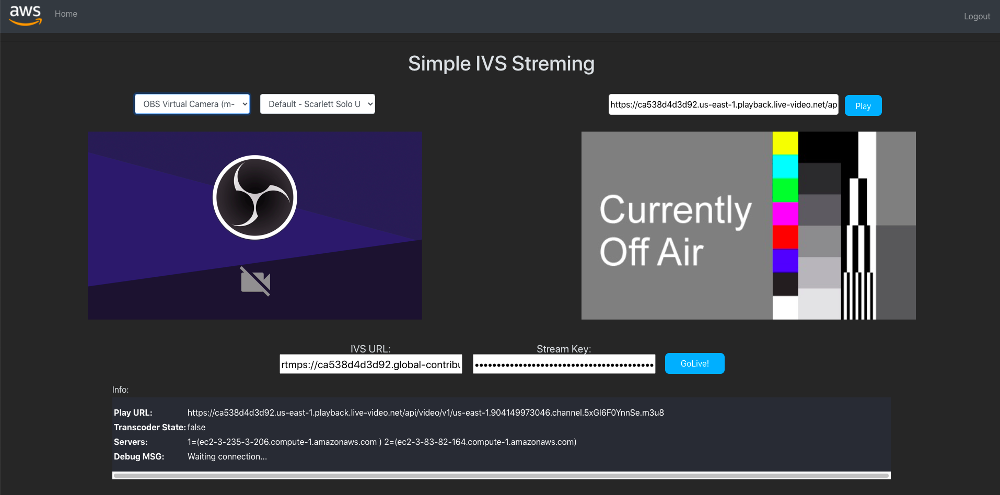
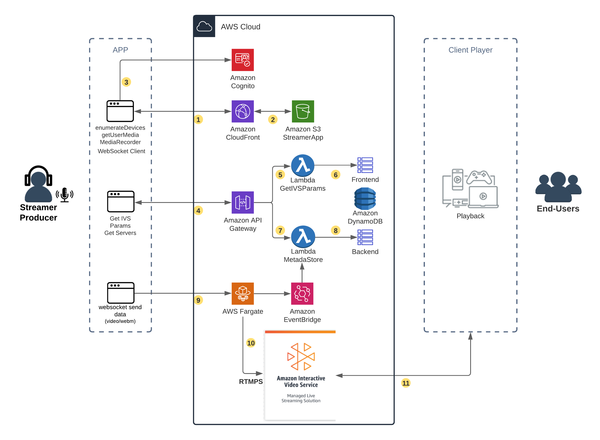
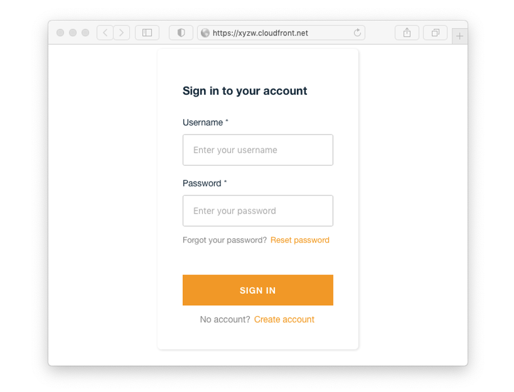
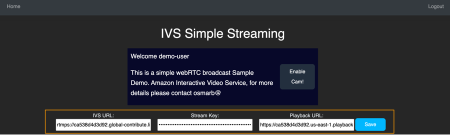
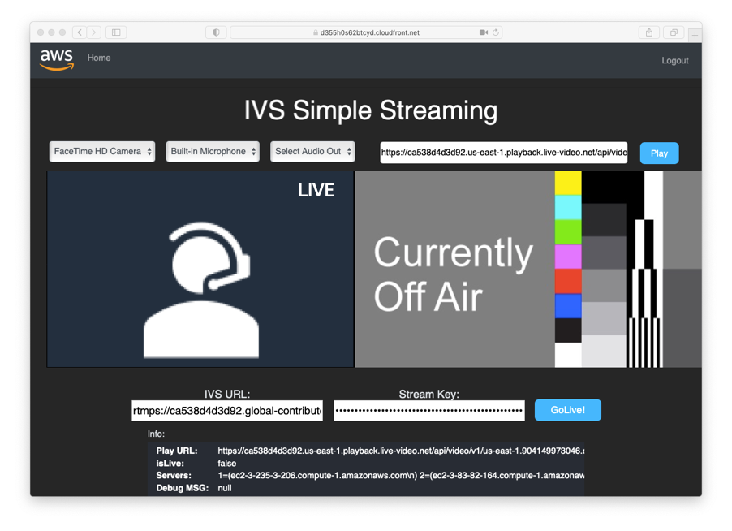

# Simplifying live streaming contribution

A reference code and solution to simplify the live streaming by using the browser APIs and webRTC to capture the video.
The solution is based on small, independent, and decoupled blocks to capture cameras and transwrap video into RTMPS, sending to (Amazon Interactive Video Service(https://aws.amazon.com/ivs/)).



## Solution Architecture



## Solution Components
1.	Broadcaster app: This application uses basic browser APIs to capture audio and video media, and a client web socket to send data to the server web socket. It uses AWS Amplify, which offers tools to build scalable full-stack applications.
2.	Amazon IVS: A managed live streaming solution that is quick and easy to set up and is ideal for creating interactive video experiences.
3.	Proxy video transwrap:  This application uses Node.js to open an HTTPS server for the WebSocket communication, and FFmpeg to transwrap the stream in RTMPS to Amazon IVS.    
4.	Client player: This application uses Video.js player framework to decode the video streamed by Amazon IVS. 

## Deployment Steps

### Prerequisites

To deploy the transwrap container, we must install AWS Command Line Interface (AWS CLI v2(https://docs.aws.amazon.com/cli/latest/userguide/install-cliv2.html)) and the JQ tool. JQ is a command line tool for parsing JSON. Most of the AWS CLI command we use to deploy the backend relies on JSON parsing to build and adjust the files used to configure the required AWS services. 

```
  # If you are using macOS, do:
  brew install jq

  # If you are using Amazon Linux, do:
  yum install jq

  # If you are using Ubuntu Linux, do:
  apt-get install jq
```
To build the integration with AWS components and host our web application, we use AWS Amplify. For more details on installing and configuring AWS Amplify, please visit the (Amplify Documentation for React(https://docs.amplify.aws/start/getting-started/installation/q/integration/react#option-2-follow-the-instructions)).

To build the integration with AWS components and host our web application, we use AWS Amplify. For more details on installing and configuring AWS Amplify, please visit the  (Amplify Documentation (https://docs.amplify.aws/start/getting-started/installation/q/integration/react#option-2-follow-the-instructions) for React). 

```
  sudo npm install -g @aws-amplify/cli
  aws configure
```

### Step A- Frontend and APIs: WebRTC video capture

#### 1. Clone the repository solution

```
  git clone https://github.com/aws-samples/aws-simple-streaming-webapp.git
  cd aws-simple-streaming-webapp/frontend/
  npm install
  amplify init
```
As name for the environment, please select **dev**

```
? Enter a name for the environment dev
  ? Choose your default editor: Visual Studio Code
  Using default provider  awscloudformation
  ? Select the authentication method you want to use: AWS profile
  
```
With **amplify init**, the project and resources are initialized in the AWS Cloud environment.

Now you can list the resources that it's going to be created once we push the environment creation.

```
  Current Environment: dev

  | Category | Resource name              | Operation | Provider plugin   |
  | -------- | -------------------------- | --------- | ----------------- |
  | Hosting  | S3AndCloudFront            | Create    | awscloudformation |
  | Auth     | simplewebstreaming5fec9bae | Create    | awscloudformation |
  | Storage  | IVSparam                   | Create    | awscloudformation |
  | Storage  | ISStaskdnstrack            | Create    | awscloudformation |
  | Function | saveIVSparam               | Create    | awscloudformation |
  | Function | ISSgetServers              | Create    | awscloudformation |
  | Api      | saveIVSparam               | Create    | awscloudformation |
```

As next step, we need to do a amplify push to deploy the resources in AWS Cloud. 

```
  amplify push
```

**This Command will deploy the following resources in your account:**
- API Gateway: Save and retrive IVS Parameters and ECS Container availability information
- DynamoDB: Store IVS and Container servers parameters
- Lambda Funtions: For checking stored parmeters and check Event Bridge information 

#### 2. Publish and run the Broadcaster app

To have a full HTTPS communication, required for some access to the browser camera APIs, you can publish the app to host it in Amazon S3 and use a CloudFront distribution.
If you prefer to run the Broadcaster app locally, please see the (backend documentation(https://github.com/aws-samples/aws-simple-streaming-webapp/tree/main/backend)).

 ```
  amplify publish

```

This command returns a CloudFront distribution. Please copy and open in your browser.
Your app is now online!



Now you can create your first account by clicking on Create account and sign up.

### Step B - Proxy video transwrap with Amazon ECS container

The proxy transwapper is a compound of two containers running a Node.js web server and FFmpeg. The containers run on AWS Fargate for Amazon Elastic Container Service (Amazon ECS). AWS Fargate is a serverless compute engine for containers that work with Amazon ECS, and Amazon Elastic Kubernetes Service (Amazon EKS). 

The services AWS CodeBuild and Amazon Elastic Container Registry build, store, and manage the proxy transwrap container images. AWS CodeBuild is a fully managed continuous integration service that compiles source code, runs tests, and produces software packages that are ready to deploy. Amazon Elastic Container Registry (Amazon ECR) is a fully managed container registry that makes it easy to store, manage, share, and deploy your container images and artifacts anywhere.
 
In Amazon ECS, you have three building blocks to run your containers successfully:
 
1.	Task definition: This is like a blueprint for your application, where you can define which container images to use and the resources that your container requires.
2.	Task: This is the instantiation of your task definition.
3.	Service: This launches and maintains a specified number of copies of the task definition in your cluster.
 
In this case, we have a service with two tasks, and each has its own public IP to receive the video stream via WebSocket.
 
To track each task public IP, we use Amazon EventBridge, AWS Lambda, and Amazon DynamoDB.
 
•	Amazon EventBridge: This is a serverless event bus that makes it easier to build event-driven applications at scale using events generated from your applications, integrated software as a service (SaaS) applications, and AWS services. In this case, we built a rule in Amazon EventBridge to track our tasks' start and stop status and trigger the AWS Lambda function.
•	AWS Lambda: This is a serverless compute service that lets you run code without: provisioning or managing servers; creating workload-aware cluster scaling logic; maintaining event integrations; or managing runtimes. In this case, we built an AWS Lambda Function that, when triggered by the Amazon EventBridge, updates the public IP of the tasks in an Amazon DynamoDB table.
•	Amazon DynamoDB: This is a key-value and document database that delivers single-digit millisecond performance at any scale. It's a fully managed, multi-Region, multi-active, durable database with built-in security, backup and restores, and in-memory caching for internet-scale applications. In this case, we use an Amazon DynamoDB table to store the metadata of the tasks. The public IP of the tasks is part of the metadata.
 
The backend deployment is built using a bash shell script located under simple-streaming-webapp/backend that runs AWS CLI commands to build the environment.

#### 1. Deploy the backend environment

```
  cd simple-streaming-webapp/backend
  ./install_ivs_backend.sh deploy all
```

### Step C. Application setup 
You can skip this task if you already have an Amazon IVS channel created. For more details, please visit 8Amazon IVS documentation(https://docs.aws.amazon.com/ivs/)).

#### 1. Create a channel on Amazon IVS

```
  ./create_ivs_channel.sh ivs-webrtc
```

#### 2. Copy and save the ingestEndpoint, streamKey value, and playbackUrl 

```
  Copy EndPoint: rtmps://6f0eda55d6df.global-contribute.live-video.net:443/app/

  Copy StreamKey: sk_us-east-1_siFTKMADpmqe_dzUYPKAZjbE1lcrbQdudLAxyzw

  Copy playbackUrl: https://8f97718d90a0.us-east-1.playback.live-video.net/api/video/v1/us-east-1.098435415742.channel.cxyzwe.m3u8
```

#### 3. Add the ingestEndpoint, streamKey value and playbackUrl to the interface



### Step D. Test your live stream with your browser
Select your preferred camera and audio input and click on Go Live!

**You might need to allow your browser to open the WebSocket URL HTTPS self-signed certificate. The broadcaster app will check the connection state, showing the status of the socket connection. If the browser blocks the connection, an action button to open the URL will be displayed.**




### Step E. Clean up: remove the provisioned AWS resources 
#### 1. Removing the Broadcaster application 
If you need to remove the resources deployed by this sample, you can use the following command:

```
  cd frontend
  amplify delete
```
#### 2. Remove the Transwrap proxy server
To remove the Transwrap proxy server, use the bash script uninstall_ivs_backend.sh

```
cd backend
./uninstall_ivs_backend.sh clean all
./uninstall_ivs_backend.sh clean files
```
## Conclusion
In this blog post, we showed you how to create a serverless live stream reference architecture using AWS services Amazon IVS, AWS Lambda, Amazon EventBridge, Amazon DynamoDB, AWS Fargate, and AWS Amplify.

A reminder that this is a reference solution is not for use in a production environment, but is ideal for testing and accelerating your cloud adoption. Please reach your AWS representative, or here, for more information on architecting a custom solution for large-scale production-grade events.

## Notice

This project uses FFMPG, http://www.ffmpeg.org, please check lisensing usage.

## Security

See [CONTRIBUTING](CONTRIBUTING.md#security-issue-notifications) for more information.

## License

This library is licensed under the MIT-0 License. See the LICENSE file.