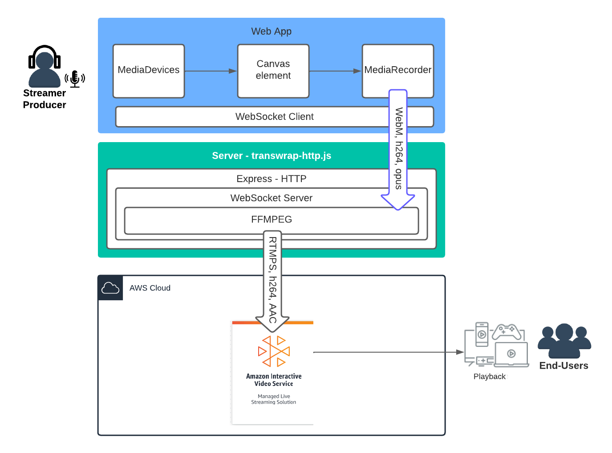

# Simplifying live streaming contribution

A reference code and solution to simplify the live streaming by using the browser APIs and webRTC to capture the video.
The solution is based on small, independent, and decoupled blocks to capture cameras and transwrap video into RTMPS, sending to (Amazon Interactive Video Service(https://aws.amazon.com/ivs/)).

## Solution Architecture

## Solution Components
1.	Broadcaster app: This application uses basic browser APIs to capture audio and video media, and a client web socket to send data to the server web socket. It uses AWS Amplify, which offers tools to build scalable full-stack applications.
2.	Amazon IVS: A managed live streaming solution that is quick and easy to set up and is ideal for creating interactive video experiences.
3.	Proxy video transwrap:  This application uses Node.js to open an HTTPS server for the WebSocket communication, and FFmpeg to transwrap the stream in RTMPS to Amazon IVS.    

## This project is intended for education purposes only and not for production usage.
A reminder that this is a reference solution is not for use in a production environment, but is ideal for testing and accelerating your cloud adoption. Please reach your AWS representative, [click or here](https://pages.awscloud.com/Media-and-Entertainment-Contact-Us.html), for more information on architecting a custom solution for large-scale production-grade events.

This is a serverless application, leveraging [Amazon IVS](https://aws.amazon.com/ivs), [AWS Amplify](https://aws.amazon.com/amplify/), [Amazon API Gateway](https://aws.amazon.com/api-gateway/), [AWS Lambda](https://aws.amazon.com/lambda/), [Amazon DynamoDB](https://aws.amazon.com/dynamodb), [Amazon S3](https://aws.amazon.com/s3/). The web user interface is built using React.js. 

## Deployment options:
:warning: **NOTE:** Deploying this demo application in your AWS account will create and consume AWS resources. 

### :video_camera: [1. To deploy the application API's and run the client app locally](/frontend/README.md)
We will need to deploy the API's, Lambda Functions and Authentication resources, we will use AWS Amplify.

### :rocket: [2. Deployment of the Proxy AWS Fargate and web App Publish](/backend/README.md)
This is an optional step to provisione a ECS Docker Container to work a remote transwrap proxy, that will translate from WebRTC to RTMPS.

## Simplifying live streaming contribution - run locally.
This sample demo app, captures the video and use a proxy in node.js to transwrap the stream to  Amazon IVS

*Detailed Video Workflow:*

The server - transwrap-http.js can be local or remote, according to the steps that you will follow.
For improving browser compatibility, the video element was embedded in a canvas element, as HTMLMediaElement.captureStream() has limited support. HTMLCanvasElement.captureStream() compatibility can be observed in the link [captureStream()](https://developer.mozilla.org/en-US/docs/Web/API/HTMLCanvasElement/captureStream)

## Next step
[Deploy the application API's and run the client app locally](/frontend/README.md)

## Additional guides in this repository
* [*Backend: Transwraping Amazon ECS container:*](/backend/README.md)Install  the remote video transwrap server.
* [*Create a IVS Channel using a shell script*](/backend/CREATEIVS.md)
* [*Customize the web app and compatibility discussions*](frontend/BROWSER.md)

## Notice
This project uses FFMPG, http://www.ffmpeg.org, please check lisensing usage.

## Security
See [CONTRIBUTING](CONTRIBUTING.md#security-issue-notifications) for more information.

## License
This library is licensed under the MIT-0 License. See the LICENSE file.