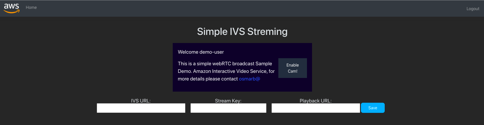
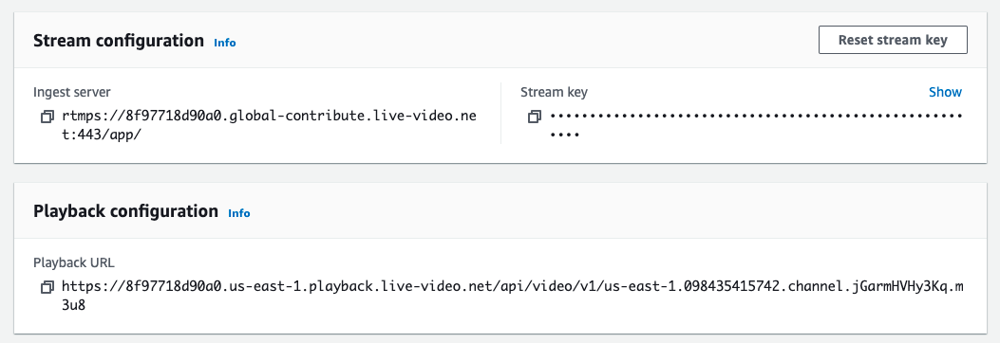
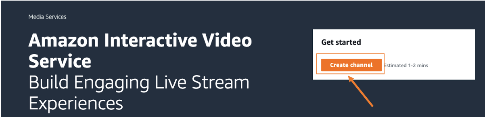
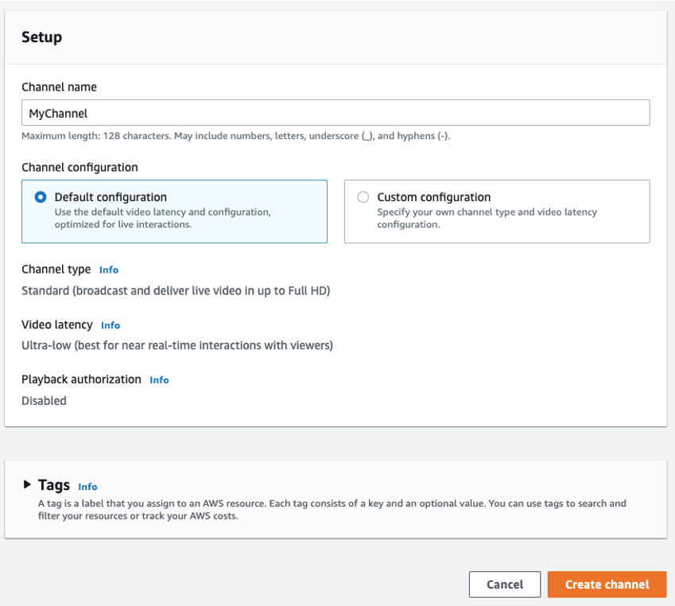
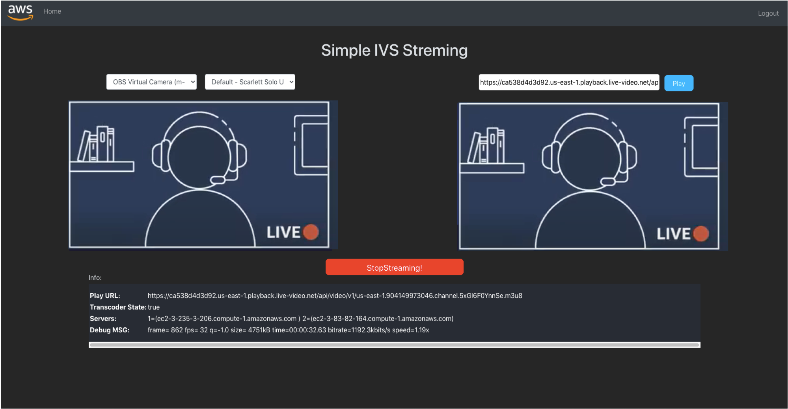

# Simple webRTC to RTMP for Amazon Interactive Video Streaming

Reference code and solution to simplify the live streaming by using the browser APIs and webRTC to capture the video.
The solution is based on small, idependent and decoupled blocks to capture cameras and transwrap it to RTMP 


## Solution Architecture

## Deployment Steps

### Pre-requeriments

For deploying the transwrap container, we will need to install AWS Cli (Install AWS Cli (https://docs.aws.amazon.com/cli/latest/userguide/install-cliv2.html)) and the jq tool. 

``` 
# If you are using Mac OS, do:
brew install jq

# If you are using Amazon Linux, do:
yum install jq

# If you are using Ubuntu Linux, do:
apt-get install jq
```

For building the integration with AWS components and host our web application we will be using AWS Amplify. 
For more complete steps of installing and configure AWS Amplify please visit the documentation (Amplify Documentation (https://docs.amplify.aws/start/getting-started/installation/q/integration/react#option-2-follow-the-instructions) for React). 

```
  npm install -g @aws-amplify/cli
  amplify configure
  amplify init
```

### A- Backend: Transwraping container ECS 

For building the transraping container you will need to perform steps to prepare your AWS environment (roles, policies and the AWS resources to support the backend). 

#### 0. Change to the backend folder insider the git project you just downloaded

The whole backend commands for deploy was designed to be ran from simple-streaming-webapp/backend. If you forget this step, the deployment will not work properly.

```
cd simple-streaming-webapp/backend
```

#### 1. Creating the roles and policies

Our containers will be running in AWS Fargate and our automation will be done by AWS Lambda. Both of these resource will require roles to run and perform actions against other AWS services.

##### 1.1 Create the Amazon ECS execution role that will be used on our ECS Container.

```
aws iam create-role --role-name ivs-ecs-execution-role \
--assume-role-policy-document file://json_configs/ivs_ecs_trust_policy.json \
| jq '.Role.Arn' | sed 's/"//g' > ./temp_files/ivs_ecs_execution_role_arn.txt
```

##### 1.2 Attach the required policies to Amazon ECS execution role you just created.

```
aws iam attach-role-policy --role-name ivs-ecs-execution-role \
--policy-arn arn:aws:iam::aws:policy/service-role/AmazonECSTaskExecutionRolePolicy \
&& aws iam attach-role-policy --role-name ivs-ecs-execution-role \
--policy-arn arn:aws:iam::aws:policy/AWSOpsWorksCloudWatchLogs
```

##### 1.3 Create the AWS Lambda execution role that will allow lambda to access the required AWS resources.

```
aws iam create-role --role-name ivs-lambda-role \
--assume-role-policy-document file://json_configs/ivs_lambda_trust_policy.json
```

##### 1.4 Attach the required policies to AWS Lambda execution role you just created.

```
aws iam attach-role-policy --role-name ivs-lambda-role \
--policy-arn arn:aws:iam::aws:policy/service-role/AWSLambdaBasicExecutionRole \
&& aws iam attach-role-policy --role-name ivs-lambda-role \
--policy-arn arn:aws:iam::aws:policy/AmazonEC2ReadOnlyAccess \
&& aws iam attach-role-policy --role-name ivs-lambda-role \
--policy-arn $(aws iam create-policy --policy-name ivs_dynamodb \
--policy-document file://json_configs/ivs_lambda_dynamodb_policy.json \
| jq '.Policy.Arn' | sed 's/"//g' > ./temp_files/lambda_policy_arn.txt \
&& cat ./temp_files/lambda_policy_arn.txt)
```

#### 2. The AWS Lambda funtion

The lambda function named ivs-ip-register will be used to capture the public ip's of AWS Fargate tasks and save it in a DynamoDB table.

##### 2.1 Creates lambda.json with our lambda configuration

```
lambda_role_arn=$(aws iam get-role --role-name ivs-lambda-role \
| jq '.Role.Arn' | sed 's/"//g') \
&& jq --arg v "$lambda_role_arn" '. |= . + {"Role":$v}' \
./json_models/lambda_model.json > ./json_configs/lambda.json
```

##### 2.2 Creates the ivs-ip-register lambda function

```
aws lambda create-function --cli-input-json file://json_configs/lambda.json \
--zip-file fileb://lambda.zip
```

#### 3. The Amazon DynamoDB table

The Amazon DynamoDB table named ivs-task-dns-track will be used to keep track of the public ip's of each AWS Fargate task. 

##### 3.1 Creates the Amazon DynamoDB ivs-task-dns-track table

```
aws dynamodb create-table --cli-input-json file://json_configs/dynamodb_table.json
```
##### 3.2 Populates the Amazon DynamoDB ivs-task-dns-track table with the initial values

```
aws dynamodb batch-write-item --request-items \
file://json_configs/ivs_dynamodb_populate.json --return-consumed-capacity INDEXES
```

#### 4. The Security Group

The services from AWS Fargate will require a security group to allow incomming traffic on 443 (https).

```
aws ec2 create-security-group --group-name ivs-sg \
--description "IVS WetRTC Security Group" --vpc-id $(aws ec2 describe-vpcs \
| jq '.Vpcs[] | select(.IsDefault)' | jq '.VpcId' | sed 's/"//g') \
| jq '.GroupId' | sed 's/"//g' > ./temp_files/ivs_sg.txt && while read line; \
do aws ec2 authorize-security-group-ingress --group-id $(cat ./temp_files/ivs_sg.txt) \
--protocol tcp --port $line --cidr 0.0.0.0/0; done < ./json_models/ivs_ports.txt
```

#### 5. The Amazon ECS cluster 

The Amazon ECS will be used to run the our services and tasks (containers it self). As we are opting to use AWS Fargate (serveless option of Amazon ECS) we will just need to define the cluster, task definitions and service.

##### 5.1 Creates the Amazon ECS Cluster named ivs

```
aws ecs create-cluster --cluster-name ivs \
| jq '.cluster.clusterArn' | sed 's/"//g' > ./temp_files/ecs_cluster_arn.txt
```

##### 5.2 Configures the ivs_task_definition.json file with the correct Amazon ECS execution previously created

```
ecs_role_arn=$(cat ./temp_files/ivs_ecs_execution_role_arn.txt) \
&& jq --arg v "$ecs_role_arn" '. |= . + {"taskRoleArn":$v,"executionRoleArn":$v}' \
./json_models/ivs_task_definition_model.json > ./json_configs/ivs_task_definition.json
```
##### 5.3 Creates Amazon ECS Task Definition named ivs-webrtc

```
aws ecs register-task-definition --cli-input-json file://json_configs/ivs_task_definition.json
```

##### 5.4 Select the proper subnets from your default vpc to be used by Amazon ECS Service

```
aws ec2 describe-subnets --filter Name=vpc-id,Values=$(aws ec2 describe-vpcs \
| jq '.Vpcs[] | select(.IsDefault)' | jq '.VpcId' | sed 's/"//g') \
--query 'Subnets[?MapPublicIpOnLaunch==`true`].SubnetId' \
| sed -e '/^$/d;:a;N;$!ba;s/\n//g;s/ //g;s/[][]//g;s/.$//;s/^.//' > ./temp_files/my_subnets.txt
```

##### 5.5 Creates the template ivs_ecs_service.json to be used by the Amazon ECS Server

```
store_sgid=$( cat ./temp_files/ivs_sg.txt) \
&& store_subnets=$(sed -e 'N;s/\n//;N;s/\n//;N;s/\n//' ./temp_files/my_subnets.txt \
| sed -e 'N;s/\n//;s/ //g;s/[][]//g;s/^"//g;s/"$//g') \
&& jq --arg v "$store_subnets" '.networkConfiguration.awsvpcConfiguration |= . + {"subnets":[$v]}' \
./json_models/ecs_services_model.json | \
jq --arg v "$store_sgid" '.networkConfiguration.awsvpcConfiguration |= . + {"securityGroups":[$v]}' \
| sed -e 's/\\//g' > ./json_configs/ivs_ecs_service.json
```

##### 5.6 Creates the Amazon ECS service named ivs-webrtc

```
aws ecs create-service --cli-input-json file://json_configs/ivs_ecs_service.json
```

#### 6. Creating the Amazon EventBridge Rule

The Amazon EventBridge will detect changes on our ecs tasks from ivs-webrtc service and trigger our lambda function ivs-ip-register. The ivs-ip-register will then filter the events of Stop and Running type to keep the DynamoDB ivs-task-dns-track table updated.

##### 6.1 Configures the ivs_events_rule.json with the correct ivs service configured in out Amazon ECS Cluster

```
ecs_arn=$(cat ./temp_files/ecs_cluster_arn.txt) \
&& sed -e "s@ARN_HERE@${ecs_arn}\\\@g" \
json_models/ivs_events_rule_model.json > ./json_configs/ivs_events_rule.json
```

##### 6.2 Create the Amazon EventBridge rule named ip-register

```
aws events put-rule --cli-input-json file://json_configs/ivs_events_rule.json \
| jq '.RuleArn' | sed 's/"//g' > ./temp_files/ivs_event_rule_arn.txt
```

##### 6.3 Creating the resource policy template

```
aws lambda get-function --function-name ivs-ip-register \
| jq '.Configuration.FunctionArn' | sed 's/"//g' \
> ./temp_files/ivs_lambda_function_arn.txt
```
##### 6.4 Adding permission to ip-register rule invoke lambda funtion ivs-ip-register

```
aws lambda add-permission --function-name ivs-ip-register \
--action lambda:InvokeFunction --statement-id events \
--principal events.amazonaws.com --source-arn=$(cat ./temp_files/ivs_event_rule_arn.txt)
```

##### 6.5 Add lambda function ivs-ip-register as a target to the event rule ip-register

```
aws events remove-targets --rule ip-register --ids "1" \
&& aws events put-targets --rule ip-register \
--targets "Id"="1","Arn"="$(cat ./temp_files/ivs_lambda_function_arn.txt)"
```
#### 7. Creating cloudwatch log group name for ivs-webrtc tasks

This will create the log group name /ecs/ivs-webrtc in cloudwatchlogs. This log group will receive the logs from the Fargate tasks.

```
aws logs create-log-group --log-group-name /ecs/ivs-webrtc
```

#### 8. Adjusting the Amazon ECS Service ivs-webrtc

This last step will allow ivs-webrtc to create two tasks and the automation (EventBridge, Lambda) will register the public ip's of each task to DynamoDB ivs-task-dns-track table.

##### 8.1 Configures the ivs-webrtc service run two tasks

```
aws ecs update-service --cluster ivs --service ivs-webrtc --desired-count 2
```

### B- Frontend and APIS: webRTC video capture 

#### 1. Project Dependencies

For building the integration with AWS components and host our web application we will be using AWS Amplify. 
For more complete steps of installing and configure AWS Amplify please visit the documentation (Amplify Documentation (https://docs.amplify.aws/start/getting-started/installation/q/integration/react#option-2-follow-the-instructions) for React). 

```
  npm install -g @aws-amplify/cli
  amplify configure
```

#### 2. Clone the repository solution

```
  git clone https://github.com/osmarbento-AWS/simple-streaming-webapp.git
  cd simple-streaming-webpp/frontend/
  npm install
  amplify init --app https://github.com/osmarbento-AWS/simple-streaming-webapp.git
  amplify init
  amplify push
```

{}
This Command will deploy the following resources in your account:
- API Gateway: Save and retrive IVS Parameters and ECS Container availability information
- DynamoDB: Store IVS and Container servers parameters
- Lambda Funtions: For checking stored parmeters and check Event Bridge information 
{}

#### 3. Run the solution in your local envirolment

```
  npm start
```

#### 4. Application Configuration
In your local envirolment http://127.0.0.1:3000 the following application will be loaded



Go to [Amazon Interactive Video Service Console](https://console.aws.amazon.com/ivs/) and copy the parameters to add in the Simple Streaming Solution.



Add into the Simple Streaming Solution and Save!


If you don't have a channel created on IVS yet, you can follow the 3 simple steps bellow

#### 4.1. (Optional): Creating a Channel on Amazon Iteractive Video Service

a. Go to [Amazon Interactive Video Service Console](https://console.aws.amazon.com/ivs/)

b. Create your IVS Channel
In simple two steps:




Finally copy the IVS parameters and add to the interface.


#### 5. Test your live streaming from your browser

Select your prefered camera and audio input and click on Go Live!

