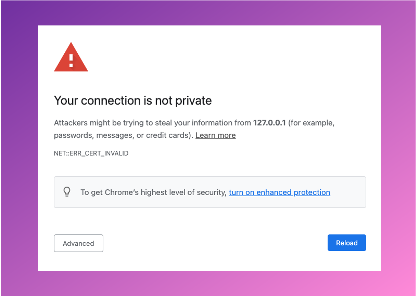

# Simplifying live streaming contribution - running in Amazon ECS Container

## Deploy the backend environment

The proxy transwapper is a compound of two containers running a NodeJS web server and FFmpeg. The containers are running on AWS Fargate for Amazon ECS. The AWS Fargate is a serverless compute engine for containers that work with Amazon Elastic Container Service (ECS) and Amazon Elastic Kubernetes Service (EKS). 
 
In Amazon ECS, you have three building blocks to run your containers successfully:
 
Task definition: It is like a blueprint for your application. It is where you which docker images to use and the resources that your container will require.
 
Task: It is the instantiation of your task definition.
 
Service: It launches and maintains a specified number of copies of the task definition in your cluster.
 
In our case, we have a service with two tasks, and each has its own public IP to receive the video stream via WebSocket.
 
To track each task's public IP, we are using Amazon EventBridge, AWS Lambda, and Amazon DynamoDB.
 
Amazon EventBridge: This is a serverless event bus that makes it easier to build event-driven applications at scale using events generated from your applications, integrated Software-as-a-Service (SaaS) applications, and AWS services. In this case, we built a rule in Amazon EventBridge to track our tasks' start and stop status and trigger the AWS Lambda function.
 
AWS Lambda: This is a serverless compute service that lets you run code without provisioning or managing servers, creating workload-aware cluster scaling logic, maintaining event integrations, or managing runtimes. In this case, we built an AWS Lambda Function that, when triggered by the Amazon EventBridge, will update the public IP of the tasks in an Amazon DynamoDB table.
 
Amazon DynamoDB: This is a key-value and document database that delivers single-digit millisecond performance at any scale. It's a fully managed, multi-region, multi-active, durable database with built-in security, backup and restores, and in-memory caching for internet-scale applications. In this case, we use an Amazon DynamoDB table to stores the metadata of the tasks. The Public IP of the tasks is part of the metadata.
 
The backend deployment is built using a bash shell script located under aws-simple-streaming-webapp/backend that runs AWS CLI commands to build the environment.

```sh
    cd simple-streaming-webapp/backend
    ./install_ivs_backend.sh (https://github.com/osmarbento-AWS/simple-streaming-webapp/blob/withHooks/backend/install_ivs_backend.sh) deploy all
```

## HTTPS considerations
The remote ECS container uses a self signed certificate, so you might have to allow your browser to accept the self signed certificate, or add an Amazon CloudFront distribution to handle HTTPS, or add your own valid certificate to the container. 

To discover the external IP address of your transwrap server you can run:

```sh
./get_container_domain.sh
```

:warning: **Note:** For test purpose only.
Open it on your web browser add https:// in front of your domain and accept the self signed certificate.




## Cleanup - (Optional): Cleanup, removing the provisioned AWS resources. 

For removing the Transwrap proxy server, you can use the bash script uninstall_ivs_backend.

