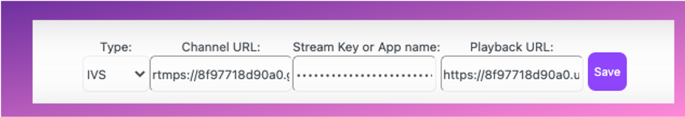
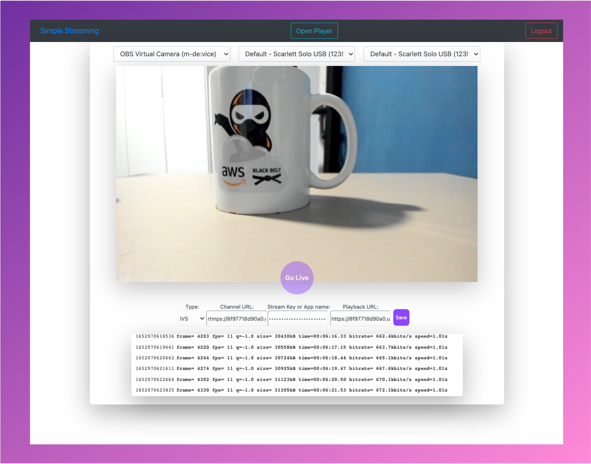

# Simplifying live streaming contribution - run locally.

This sample demo app, captures the video and use a proxy in node.js to transwrap the stream to  Amazon IVS

## Deployment Steps:

For building the integration with AWS components and host our web application, we will be using AWS Amplify. For more complete steps on installing and configuring AWS Amplify, please visit the [Amplify Documentation for React](https://docs.amplify.aws/start/getting-started/installation/q/integration/react#option-2-follow-the-instructions).

## Pre-requirements

```sh
npm install -g @aws-amplify/cli
amplify configure
```

For a more complete guide on how to get started with amplify CLI, please follow the instructions of the official [AWS Amplify Documentation](https://docs.amplify.aws/cli/start/install/#install-the-amplify-cli). 

### Frontend and APIs: WebRTC video capture:
version 2 preview

```sh
git clone --branch v2preview  https://github.com/aws-samples/aws-simple-streaming-webapp.git
cd aws-simple-streaming-webpp/frontend/
npm install
amplify init
```

As name for the environment, please select *dev*

```sh 
### Configuration details
 ? Enter a name for the environment dev
 ? Choose your default editor: Visual Studio Code
 Using default provider  awscloudformation
 ? Select the authentication method you want to use: AWS profile
```

With amplify init, the project and resources will be initialized in the AWS Cloud environment.
Now you can push, with amplify push to create the resources.

*Note:* This Command will deploy the following resources in your account:
* API Gateway: Save and retrieve IVS Parameters and ECS Container availability information
* DynamoDB: Store IVS and Container servers parameters
* Lambda Functions: For checking stored parameters and check Event Bridge information 
To list the resources that will be created you can use the command ```amplify status```

```sh
amplify push
```

### Run the solution in your local environment

```sh
npm start
```

### Create your user and password

It should load the authentication page. Now you can create your first account and sign in.


### Add the ingestEndpoint, streamKey value and playbackUrl to the interface
**[OPTIONAL] If you don't have a Amazon IVS created, you can follow [this steps](link).**
4.2. In your local environment http://127.0.0.1:3000 (http://127.0.0.1:3000/) the following application will be loaded.



### Start the server in a local environment: localhost

```sh
cd backend/
npm install
npm run startDev
```
### Test your streaming directly from your browser



### [Optional]: Cleanup, removing the provisioned AWS resources. 

```sh 
cd ../frontend
amplify delete
```

## Choose your next adventure:
* [*Backend: Transwraping Amazon ECS container:*](/backend/README.md)Install  the remote video transwrap server.
* [*Create a IVS Channel using a shell script*](/backend/CREATEIVS.md)
* [*Customize the web app and compatibility discussions*](frontend/BROWSER.md)
